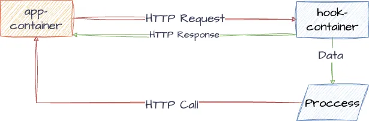
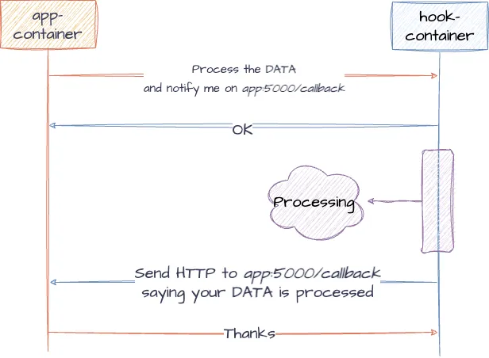

# Webhook

In this project, we are building a simple webhook application to demonstrate how
webhooks work. Webhooks are automated messages sent from apps when something happens.
They have a message—or payload—and are sent to a unique URL—essentially the app's phone number
or address. Webhooks are almost always faster than polling, and require less work on your end.
They're much like SMS notifications.

## Setup

In order to run the project, you need to have docker. By running the following command
you can start two applications in a virtual network.

```shell
docker-compose up
```

After the containers start, you can see that there is a ```app-container``` and a ```hook-container```.
There is an exposed endpoint in app service, by which you can register a webhook on the hook service.
The hook service does a process, after that it will call the app service.



## Hook

In the hook service, we get a request from app that is like this:

```json
{
  "data": 5,
  "host": "app-container (ip:port/path)"
}
```

The data is just for validation, however the host is the URL which hook service calls after the process.



## More

- [Webhook Site for testing](https://webhook.site/)
- [RedHat: What is a webhook](https://www.redhat.com/en/topics/automation/what-is-a-webhook)
